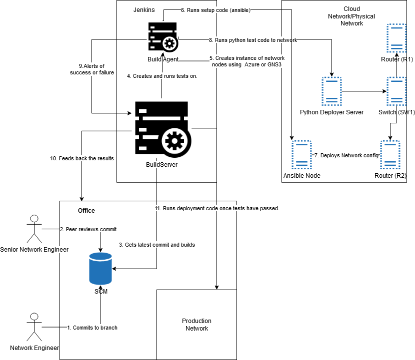
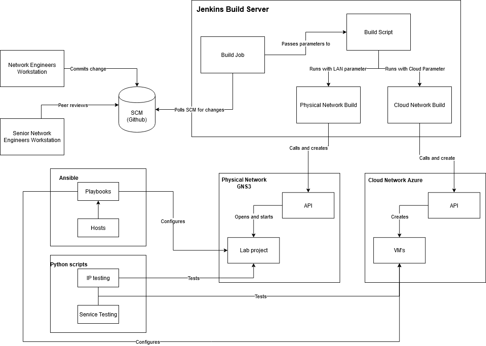

# NetDevOps Testing Pipeline
This repo is the code for my dissertation exploring NetDevOps and its useage within a network CI/CD pipeline.

The main aim of the project was to test if it was possible to make safe and tested network changes before the changes were deployed to production.

## NetDevOps- CI/CD Pipeline
 

The project contains a Lan implementation for this testing framework (using GNS3 for simulating the network")
and code for a cloud implementation using Azure cloud. The above image outlines the process for Netdevops,
with the image blow outlining the physical implementation for the test networks and CI/CD pipeline.
 ## Physical Implementation
 

The dissertation write up can be found on my site alexmarriott.work

## View project
[See the NetDevOps project on github!](https://github.com/AlexMarriott/NetDevOps)